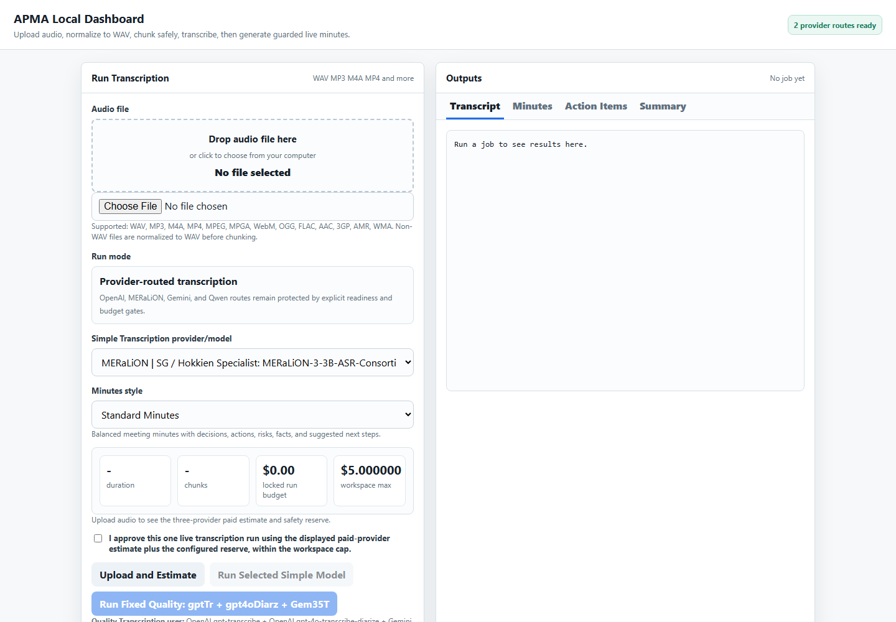

# APMA V5 Transcription Assurance MVP

An auditable, safety-first workflow for turning existing multilingual audio
files into provider-attributed transcripts, reviewable evidence, optional
minutes, and portable exports. APMA is file-based and asynchronous; it is not a
real-time meeting assistant.

[](https://github.com/TengKianBoon/APMA_V5_Audio_MVP/actions/workflows/ci.yml)



## Why APMA

APMA is designed for the difficult part of transcription work: preserving what
each model actually returned, tracking audio coverage and cost, retaining
speaker/timestamp evidence without inventing identities, and making uncertainty
visible before a transcript is treated as final.

It focuses on long, naturally code-switched Singapore conversations where
Hokkien, Singlish, Mandarin, and English may appear in the same exchange. APMA
does not claim to have invented a Hokkien foundation model or solved dialect
recognition. Its contribution is the evidence-preserving workflow around
emerging dialect-capable models: specialist and generalist routes remain
separate, disagreement remains visible, and a human retains the final judgment.

The project is deliberately single-user and local-dashboard first. Real provider
runs are opt-in; development and CI remain dry-run by default.

## What Makes The Project Unusual

- It combines Singapore-focused and multilingual providers without silently
  blending their outputs or declaring a permanent winner.
- It treats Hokkien and code-switching as product and evaluation requirements,
  not as a generic Mandarin transcription setting.
- It handles long and legacy recordings with source hashes, duration accounting,
  silence-aware chunk boundaries, resumability, and duplicate-spend protection.
- It preserves provider-native text, timing, and speaker evidence while keeping
  machine speaker labels separate from real identities.
- It joins product usability to governance: local credentials, dry-run CI,
  explicit paid-run approval, cost caps, retained provenance, exception-based
  review, and public-release confidentiality checks.

The defensible portfolio claim is therefore not "perfect Hokkien ASR." It is a
governed, reviewable method for turning uneven local-language model capability
into useful Southeast Asian recorded-conversation evidence.

## What You Can Inspect

- SHA-256-verified ingest, structural audio QC, format normalization, and
  silence-aware chunking.
- Provider-routed OpenAI, MERaLiON, Gemini, and Qwen Filetrans adapters with
  fail-closed readiness and cost gates.
- Raw provider evidence, provider-native timing/speaker metadata, deterministic
  transcript exports, comparison, reconciliation, and human-review history.
- Optional targeted human verification that presents only flagged exact clips,
  records content and speaker decisions separately, and reports actual selected
  audio coverage without claiming an unmeasured accuracy uplift.
- A local dashboard for upload, exact budget approval, transcription, review,
  minutes generation, and retained output paths. Its guided
  `Audio → Outcome → Cost → Review` flow keeps provider details available but
  secondary to the user's task.
- Docker-tested provider adapters and bounded live verification on synthetic,
  non-private audio for MERaLiON and Qwen Filetrans.
- Browser-tested synthetic import, upload progress, outcome routing, cost
  preflight, provider disclosure, and responsive layout, with no paid call.
- A consent-gated Pilot outcome workflow that derives correction, duration and
  provider-cost evidence; records bounded accuracy, adoption, unit-economics
  and trust inputs; and exports aggregates without transcript text or direct
  participant identifiers.

Start with the [showcase walkthrough](docs/SHOWCASE.md), then see the
[architecture](ARCHITECTURE.md) and
[transcription product contract](product-specs/APMA_TRANSCRIPTION_PRODUCT_CONTRACT.md).
The [targeted human verification workflow](docs/TARGETED_HUMAN_VERIFICATION.md)
defines the optional low-friction assurance step and its honest completion labels.
The [AI product competency and AIRI roadmap](docs/AIRI_PRODUCT_COMPETENCY_ROADMAP.md)
maps the work to product decisions, governance, security, trust, adoption, and
measurable value without claiming an AIRI certification.
The [solution architecture and FDE evidence map](docs/SOLUTION_ARCHITECTURE_FDE_EVIDENCE.md)
links role claims to inspectable artifacts, browser QA, and explicit gaps.
The [consented pilot runbook](docs/CONSENTED_PILOT_RUNBOOK.md) defines the
operating sequence, metric denominators, governance gates, and claim boundary.
The [commercial pilot pricing decision](docs/COMMERCIAL_PRICING.md) documents
the pay-as-you-go launch prices, market benchmarks, margin floor, and payment
go-live gates without enabling live charging.
Public releases must follow the
[clean-history release checklist](docs/PUBLIC_RELEASE_CHECKLIST.md).

## Singapore model acknowledgement

Thank you to the MERaLiON team at A*STAR I2R for granting temporary
research/evaluation API access used to validate APMA's Singapore-focused ASR
route. See the [MERaLiON API console](https://studio.meralion.ai/api-console).
This acknowledgement does not imply endorsement of APMA by MERaLiON or A*STAR.

## Phase 1 Goal

Inspect an existing audio file → chunk safely → transcribe in batch → compare
and review exceptions → export accountable outputs. Generate minutes only when
they are useful as a separate derived step.

## Safety Rules

- Do not commit secrets.
- Do not commit real private audio files.
- Use `.env` locally only.
- Keep `.env.example` safe for template values.

## Development Notes (Phase 1)

- This repository implements a conservative, single-user MVP. Follow the rules in `AGENTS.md` before making broad changes.
- Default runtime behavior is dry-run: `DRY_RUN=true` to avoid billable API calls during development and CI.
- Develop and test inside Docker. Target Python `3.11` or `3.12` for the service runtime (do not rely on local Windows Python 3.13 for production dependencies).
- Heavy audio processing (chunking, transcription, diarization, merging, translation, summarization) runs in the Python service under `services/`.
- `n8n/` is the orchestrator only — workflows should call the Python service and not contain heavy processing logic.
- The repository is licensed under the [MIT License](LICENSE). Real meeting
  recordings, credentials, and runtime provider artifacts are excluded from
  that public-safe source tree.

See `AGENTS.md` in the repo root for contributor rules and guardrails.

For the durable product requirements, see `product-specs/APMA_TRANSCRIPTION_PRODUCT_CONTRACT.md`.
For the current module/data-flow map, see `ARCHITECTURE.md`.
For offline ASR metrics and transcript-contract checks, see `docs/EVALS.md`.
For step-by-step dry-run operating instructions, see `docs/OPERATOR_GUIDE.md`.
For Release 0.1 verification, see `docs/RELEASE_0_1_CHECKLIST.md`.
For the deferred live OpenAI smoke-test procedure, see `docs/LIVE_OPENAI_SMOKE_TEST.md`.
For the browser-based local dashboard, including upload, budget locks, supported formats, live transcription, and live minutes style presets, see `docs/LOCAL_DASHBOARD.md`.
For current bounded MERaLiON and Qwen evidence, see
`docs/LIVE_PROVIDER_VERIFICATION_2026-09-11.md`. For provider decisions,
benchmark criteria, and provenance, see `docs/TRANSCRIPTION_ARCHITECTURE_4OFX.md`.
For the privacy-minimised external-pilot evidence loop, see
`docs/CONSENTED_PILOT_RUNBOOK.md`.

## Docker Quickstart (dry-run)

This project uses Docker for development and testing. The default container runs in `DRY_RUN` mode to avoid making billable API calls.

Build the Docker image:

```bash
docker build -t apma-v5:dev .
```

Run the complete test suite in the container with provider calls disabled:

```bash
docker run --rm -e DRY_RUN=true -e TRANSCRIPTION_ENGINE=mock \
  -v "$(pwd):/app" -w /app apma-v5:dev python -m pytest -q
```

Or use the provided scripts:

```bash
./scripts/run-dry-run.sh
# or (PowerShell)
./scripts/run-dry-run.ps1
```

Notes:
- Target runtime: Python `3.11-slim`.
- The image contains the Python service, dashboard, media tooling, and tests.
- Keep `DRY_RUN=true` during development and CI to avoid billing.

On Windows, run `APMA_Credentials.cmd` once to store provider keys in Windows
Credential Manager, then run `Start_APMA.cmd` to open the localhost dashboard.
Live requests still require the on-screen approval and budget controls.

## CLI (dry-run)

A conservative CLI entrypoint is available for local verification and dry-run
ingest checks. Provider network calls remain opt-in.

Run locally:

```bash
python -m services.cli
```

Ingest a WAV file (dry-run):

```bash
python -m services.cli --ingest path/to/file.wav --job-id JOB123
```

Runner API (library):

The job runner is available as `services.runner.run_job(job_id, source_path, cfg)` and performs the ingest→preprocess→retained audio package→chunk pipeline in dry-run mode, updating `jobs/<job_id>/job_manifest.json`.

Each job is also a self-contained audio subproject with a byte-verified
original, a full 128 kbps MP3, and 10-minute range-labelled MP3 chunks under
`jobs/<job_id>/audio/`. The dashboard reports the absolute addresses of the
subproject and each retained media folder.

Transcription (mock):

This repository includes a deterministic mock transcription interface for dry-run testing:

- `services.transcription.get_transcriber("mock")` returns a `MockTranscriber`.
- `MockTranscriber.transcribe_chunk(job_id, chunk_meta, cfg)` writes a JSON transcript to `jobs/<job_id>/transcripts/`.

The mock transcriber is strictly dry-run (it enforces `cfg.dry_run == True`) and performs no network or model calls.

Full transcript outputs (dry-run):

After transcription completes, the runner aggregates per-chunk transcript JSON files into:

- `jobs/<job_id>/outputs/full_transcript.json`
- `jobs/<job_id>/outputs/full_transcript.txt`
- `jobs/<job_id>/outputs/full_transcript.html`
- `jobs/<job_id>/outputs/full_transcript.srt`
- `jobs/<job_id>/outputs/full_transcript.vtt`

`full_transcript.json` is the canonical transcript authority. The HTML file is a deterministic,
self-contained human view derived from that JSON. SRT and VTT include only segments with valid
provider timestamps; the exporter does not invent timing for untimed text.

The job manifest records these paths under `outputs.full_transcript_json`,
`outputs.full_transcript_txt`, `outputs.full_transcript_html`,
`outputs.full_transcript_srt`, and `outputs.full_transcript_vtt`.

Mock minutes exports (dry-run):

The runner also creates deterministic mock meeting exports after full transcript aggregation:

- `jobs/<job_id>/outputs/minutes.md`
- `jobs/<job_id>/outputs/action_items.json`
- `jobs/<job_id>/outputs/job_summary.json`

The job manifest records these paths under `outputs.minutes_md`, `outputs.action_items_json`, and `outputs.job_summary_json`.

Selecting a transcription engine:

- Configure the engine with `TRANSCRIPTION_ENGINE` (default: `mock`).
- The runner uses `services.transcription.get_transcriber(cfg.transcription_engine)` to resolve the implementation.
- OpenAI adapter is opt-in and protected by DRY_RUN + explicit enable flags and cost/file-size preflight; do not enable in CI.

Architecture status: [APMA 4ofX Transcription Architecture Status](docs/TRANSCRIPTION_ARCHITECTURE_4OFX.md)


Example output (dry-run verification):

```
APMA V5 dry-run verification
Python 3.11.x
DRY_RUN=True
```
