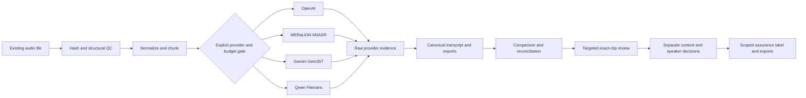

# APMA Showcase Walkthrough

APMA demonstrates how a single-user transcription-assurance workspace can turn
existing, long, code-switched Southeast Asian recordings into reviewable
records while keeping provider evidence, cost, provenance, and human judgment
separate. It processes files asynchronously; it is not a real-time meeting
assistant.


The screenshot uses synthetic configuration only. It contains no real meeting
audio, transcript, credential, or private job data.

## Browser-tested professional workflow

The current dashboard guides the operator through
`Audio → Outcome → Cost → Review`. Provider/model identifiers remain available
under advanced details, while the primary choices describe the result the user
wants: Fast Draft, SEA Multilingual, Speaker-labelled, or Compare & Verify.

Compare & Verify now offers an optional targeted human verification path. APMA
reports the exact flagged clip count, selected-audio duration, and share of the
recording; the reviewer then records words and speaker judgments separately.
“Still unclear” remains unresolved, and a selected-window label never implies
full-audio human review. See the
[workflow and assurance boundary](TARGETED_HUMAN_VERIFICATION.md).

On 2026-09-11, the actual browser flow was exercised in Docker with the tracked
`synthetic_legacy_amr_wb.amr` fixture. File selection, upload progress, duration
and chunk coverage, cost preflight, all four outcome choices, MERaLiON
preference for SEA Multilingual, and the approval boundary passed. No provider
run was approved or started. A tablet grid-stretch defect found during that
test was fixed and rechecked at 800 pixels.

See the machine-readable
[synthetic UI verification record](evidence/ui-flow-showcase-2026-09-11.json).

## Pilot evidence loop

The local dashboard now includes a progressive **Pilot outcome** tab. It turns
the proposed design-partner pilot into an executable measurement workflow:

- synthetic QA is kept separate and excluded from external-pilot aggregates;
- real pilot records require structured purpose, consent-basis, provider,
  withdrawal-route, and retention-review attestations;
- duration, provider cost, segment count, and correction history come from the
  retained job rather than operator re-entry;
- dialect, meaning-unit, critical-term, speaker, review-effort, adoption, trust,
  price, and support measurements use bounded fields; and
- the aggregate JSON suppresses participant codes, consent references, source
  hashes, transcript text, and audio.

This is pilot infrastructure, not evidence that adoption or dialect-accuracy
targets have been achieved. See the [consented pilot runbook](CONSENTED_PILOT_RUNBOOK.md)
and [synthetic pilot-workflow verification](evidence/pilot-workflow-showcase-2026-09-11.json).

## Why this is more than an API wrapper

Hokkien, Singlish, Mandarin, and English can occur within one natural
conversation. Models differ in dialect coverage, diarization, timing, file
limits, price, and availability, so one fluent transcript is not sufficient
evidence of correctness.

APMA combines dialect-capable and general multilingual routes without
pretending that their outputs are independent human witnesses. It preserves
each candidate, aligns comparable regions, exposes disagreement, limits paid
rescue to uncertain regions, and leaves consequential wording to human review.
The project does not claim perfect Hokkien recognition or a new foundation
model; it contributes the governed end-to-end system around those models.

## End-to-end flow



## Provider status: evidence, not marketing

| Route | Repository status | Evidence boundary |
| --- | --- | --- |
| OpenAI transcription and diarization | Implemented and covered by guarded live workflows | Live execution requires an explicit paid-run approval and job cap. |
| MERaLiON `M3ASR` | Selectable; adapter re-verified on 11.63 seconds of synthetic speech on 2026-09-11 | The hosted response resolved to `MERaLiON/MERaLiON-3-3B-ASR-CTM`. The temporary research/evaluation grant is time-limited; future availability remains a provider dependency. |
| Gemini `Gem35T` | Selectable; adapter and contracts are dry-run tested | This public release does not include a current live-verification record for Gemini. Provider-native speaker/timing evidence remains separate from real identity. |
| Qwen `QwenA3FT` | Selectable; asynchronous Filetrans re-verified inside APMA on 11.63 seconds of synthetic speech on 2026-09-11 | The live run used the size-bounded `data_uri` compatibility path and returned native timing plus one provider speaker label. Private OSS remains available for larger production chunks. |

See [the current live-provider verification record](LIVE_PROVIDER_VERIFICATION_2026-09-11.md)
for bounded MERaLiON/Qwen evidence and
[the 4ofX transcription architecture](TRANSCRIPTION_ARCHITECTURE_4OFX.md) for
provider-role and provenance decisions.

## Safety properties worth reviewing

- `DRY_RUN=true` is the default for development and CI.
- A live request needs an explicit provider gate, credential readiness, displayed
  estimate, and per-job cost cap.
- Real meeting audio, runtime jobs, `.env`, keys, and credentials are ignored.
- Provider JSON is retained before derived cleanup or normalization.
- Timestamp-less models do not receive fabricated sentence timing.
- Machine speaker labels remain provider-scoped and are never promoted to real
  names without human review.
- Qwen signed URLs and credential material are redacted from retained artifacts.
- Qwen `data_uri` input is limited to 9 MiB of raw chunk audio by default;
  longer recordings are divided without shortening source duration.

## Run the public-safe verification

```powershell
docker build -t apma-v5:showcase .
docker run --rm -e DRY_RUN=true -v "${PWD}:/app" -w /app apma-v5:showcase pytest -q
```

These commands run the repository test suite in Docker with external provider
execution disabled.

## Current publication boundary

The source is available under the MIT License after the prepared branch is
reviewed and released. It is not a hosted multi-user service: the local
dashboard has no authentication and must not be exposed directly to the public
internet. The private development repository must not simply be switched to
public because older private branches are outside the reviewed release
boundary; use the clean-history release procedure instead.

For the product, governance, adoption, and value plan, see the
[AI product delivery roadmap](AI_PRODUCT_DELIVERY_ROADMAP.md).
For an artifact-linked and limitation-aware decision chain, see
[Engineering Decisions and Field Learnings](ENGINEERING_DECISIONS_AND_FIELD_LEARNINGS.md).
For pilot operation and publication boundaries, see the
[Consented Pilot Runbook](CONSENTED_PILOT_RUNBOOK.md).
