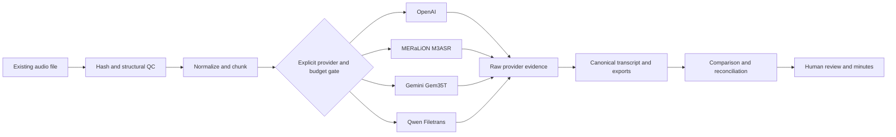

# APMA Showcase Walkthrough

APMA demonstrates how a single-user transcription-assurance workspace can turn
existing, long, code-switched Southeast Asian recordings into reviewable
records while keeping provider evidence, cost, provenance, and human judgment
separate. It processes files asynchronously; it is not a real-time meeting
assistant.


The screenshot uses synthetic configuration only. It contains no real meeting
audio, transcript, credential, or private job data.

## Why this is more than an API wrapper

Hokkien, Singlish, Mandarin, and English can occur within one natural
conversation. Models differ in dialect coverage, diarization, timing, file
limits, price, and availability, so one fluent transcript is not sufficient
evidence of correctness.

APMA combines dialect-capable and general multilingual routes without
pretending that their outputs are independent human witnesses. It preserves
each candidate, aligns comparable regions, exposes disagreement, limits paid
rescue to uncertain regions, and leaves consequential wording to human review.
The project does not claim perfect Hokkien recognition or a new foundation
model; it contributes the governed end-to-end system around those models.

## End-to-end flow



## Provider status: evidence, not marketing

| Route | Repository status | Evidence boundary |
| --- | --- | --- |
| OpenAI transcription and diarization | Implemented and covered by guarded live workflows | Live execution requires an explicit paid-run approval and job cap. |
| MERaLiON `M3ASR` | Selectable; adapter re-verified on 11.63 seconds of synthetic speech on 2026-09-11 | The hosted response resolved to `MERaLiON/MERaLiON-3-3B-ASR-CTM`. The temporary research/evaluation grant is time-limited; future availability remains a provider dependency. |
| Gemini `Gem35T` | Selectable; adapter live-verified on the same synthetic sample | Provider-native speaker/timing evidence is retained; speaker labels are not identities. |
| Qwen `QwenA3FT` | Selectable; asynchronous Filetrans re-verified inside APMA on 11.63 seconds of synthetic speech on 2026-09-11 | The live run used the size-bounded `data_uri` compatibility path and returned native timing plus one provider speaker label. Private OSS remains available for larger production chunks. |

See [the current live-provider verification record](LIVE_PROVIDER_VERIFICATION_2026-09-11.md)
for bounded MERaLiON/Qwen evidence and
[the 4ofX transcription architecture](TRANSCRIPTION_ARCHITECTURE_4OFX.md) for
provider-role and provenance decisions.

## Safety properties worth reviewing

- `DRY_RUN=true` is the default for development and CI.
- A live request needs an explicit provider gate, credential readiness, displayed
  estimate, and per-job cost cap.
- Real meeting audio, runtime jobs, `.env`, keys, and credentials are ignored.
- Provider JSON is retained before derived cleanup or normalization.
- Timestamp-less models do not receive fabricated sentence timing.
- Machine speaker labels remain provider-scoped and are never promoted to real
  names without human review.
- Qwen signed URLs and credential material are redacted from retained artifacts.
- Qwen `data_uri` input is limited to 9 MiB of raw chunk audio by default;
  longer recordings are divided without shortening source duration.

## Run the public-safe verification

```powershell
docker build -t apma-v5:showcase .
docker run --rm -e DRY_RUN=true -v "${PWD}:/app" -w /app apma-v5:showcase pytest -q
```

These commands run the repository test suite in Docker with external provider
execution disabled.

## Publication boundary

This public source snapshot is available under the MIT License. It is not a
hosted multi-user service: the local dashboard has no authentication and must
not be exposed directly to the public internet. Runtime jobs, real recordings,
credentials, raw non-public provider artifacts, and source development history
are outside this repository.

For the product, governance, adoption, and AIRI-aligned evidence plan, see the
[AI product competency roadmap](AIRI_PRODUCT_COMPETENCY_ROADMAP.md).
