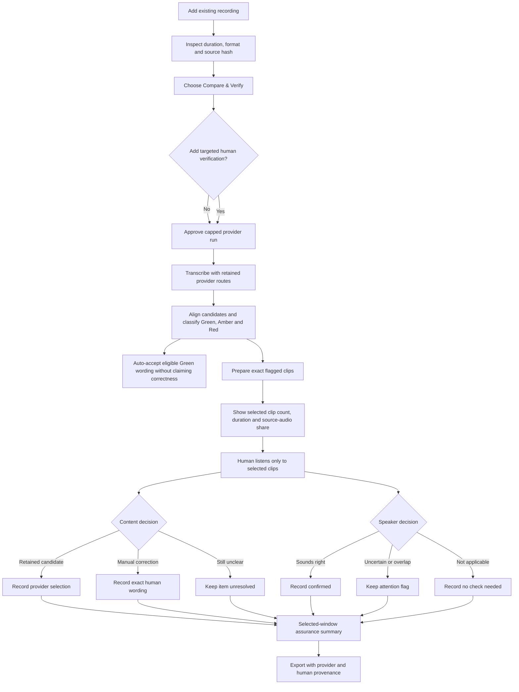

# Targeted Human Verification

## Product promise

> AI identifies where attention is needed; humans listen only to the relevant clips and verify the words and speakers before release.

This optional Compare & Verify step is designed for recordings where Hokkien, names, numbers, decisions, or speaker attribution matter. It reduces review scope; it does not promise a generic accuracy uplift or imply that the full recording was manually reviewed.

## Improved workflow

## Assurance labels

| Label | Meaning |
| --- | --- |
| Automated transcript | No human content or speaker decision has been recorded. |
| Selected-window human reviewed with unresolved items | A human reviewed at least one selected clip, but content, speaker attribution, or both still need attention. |
| Selected-window human confirmed | Every selected clip has a resolved content decision and a resolved speaker check. |

`Selected-window human confirmed` is deliberately narrower than `full-audio human reviewed`. APMA does not issue the latter unless every applicable interval has actually been reviewed.

## What APMA measures

The review record reports facts calculated from retained artifacts:

- selected clip count and merged selected-audio duration;
- selected audio as a percentage of source duration;
- Red and Amber selected-window counts;
- retained-candidate, manual-correction, and still-unclear decisions;
- confirmed, uncertain, overlap, not-applicable, and pending speaker checks; and
- windows still requiring attention.

These operational measures motivate a user's choice with visible effort and completion. Any claim about accuracy improvement still requires a representative, consented reference evaluation with stated language mix, audio conditions, sample size, and reviewer method.

## Evidence and security boundary

- The preference is optional and off by default.
- Content and speaker decisions are stored separately.
- A still-unclear decision records human attention but creates no final text.
- Provider candidates, timestamps, hashes, and speaker evidence remain unchanged.
- Development and CI remain dry-run; this feature creates no additional provider call.
- The current workflow is local and single-user. Authentication, reviewer assignment, payment, and hosted customer-data controls are separate productisation work.
